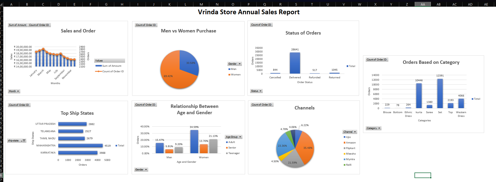

📊 Vrinda Store Annual Sales Dashboard (Microsoft Excel)

📌 Project Overview

This project presents an interactive Annual Sales Dashboard built in Microsoft Excel to analyze retail sales performance. The dashboard provides meaningful business insights by visualizing sales trends, customer demographics, product categories, order status, shipping states, and sales channels.

---

🎯 Project Objectives

- Analyze annual sales performance
- Track monthly sales and order trends
- Understand customer purchasing behavior
- Identify top-performing product categories
- Evaluate sales channels
- Monitor order status
- Generate business insights for decision-making

---

 🛠️ Tools & Technologies

- Microsoft Excel
- Pivot Tables
- Pivot Charts
- Slicers
- Data Cleaning
- Dashboard Design
- Data Visualization

---

 📈 Dashboard Features

- Monthly Sales vs Orders
- Customer Purchase by Gender
- Order Status Analysis
- Orders by Product Category
- Top Shipping States
- Sales Channel Analysis
- Age vs Gender Analysis
- Interactive Dashboard Filters

---

 💡 Key Business Insights

- Women contribute nearly **69%** of total purchases.
- Maharashtra records the highest number of orders.
- Amazon is the leading sales channel.
- The **Set** category has the highest sales.
- Adults represent the largest customer segment.
- Most orders were successfully delivered.

---

 📷 Dashboard Preview

---

🚀 Skills Demonstrated

- Business Analysis
- Data Analysis
- Dashboard Development
- Microsoft Excel
- Pivot Tables
- Pivot Charts
- Data Visualization
- Reporting
- Decision Making

---

 👨‍💻 Author

**Dharun Kumar S**

Aspiring Business Analyst | Operations Analyst | Project Management Enthusiast
